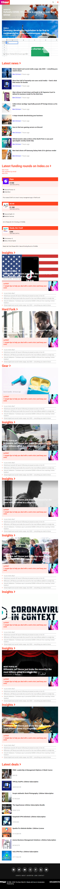
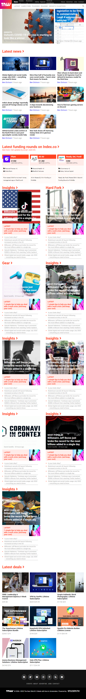
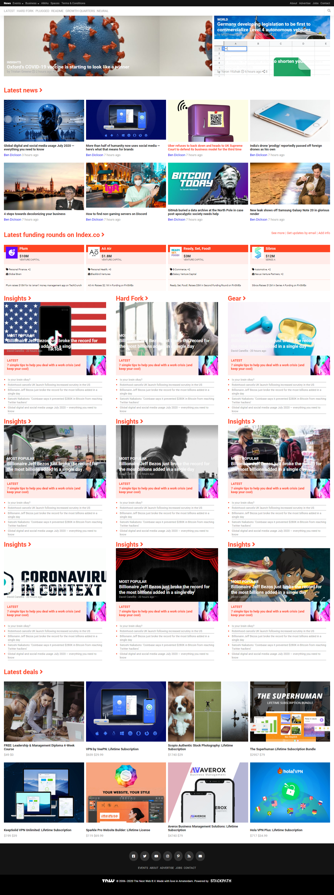

# Responsive Design: Fifth Microverse project

This project consists of responsive design. Responsiveness is attained using media queries. This project works with 3 different resolutions: 300px, 768px, and 1024px.

It consist of a navigation bar, a main tag containing the different sections and a footer at the end of the page.

# Built with

* HTML5
* CSS3
* Font Awsome 6

# Live Demo

https://rawcdn.githack.com/nrqrmz/Responsive-Design/eb7e02f2dfcdb4b7bebde475bdb464d498c720e4/index.html

# Getting Started

To run the project simply download de .zip file, extract it, and open the index.html file with your favorite browser.

# Authors

## Enrique Ramirez

* Github: https://github.com/nrqrmz
* Twitter: twitter.com@Enrique93407289
* Linkedin: https://www.linkedin.com/in/enrique-ramirez-6157b11aa/

# Contributing
Contributions, issues and feature requests are welcome!

# Show your support
Give a star if you like this project!

# Acknowledgments
This project is part of the Microverse program.

# License
This project is Microverse licensed.
